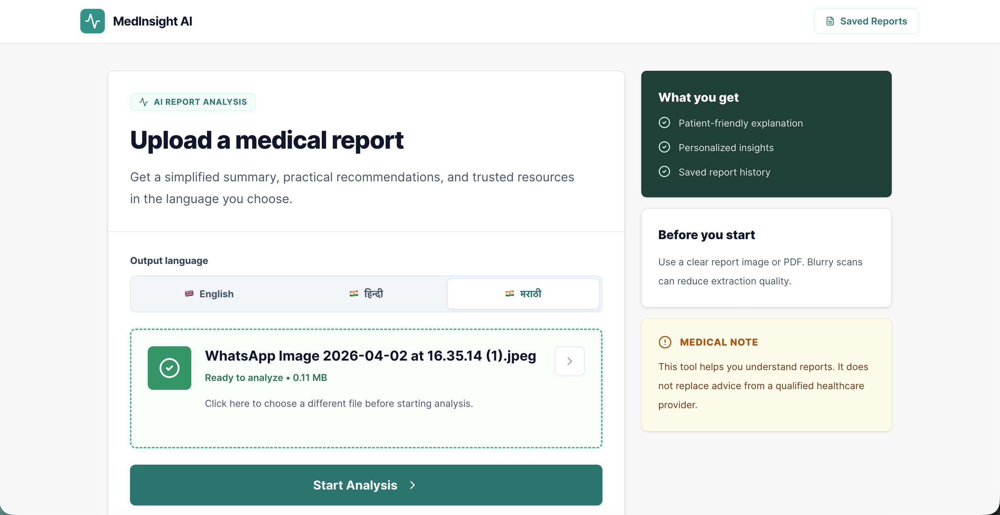
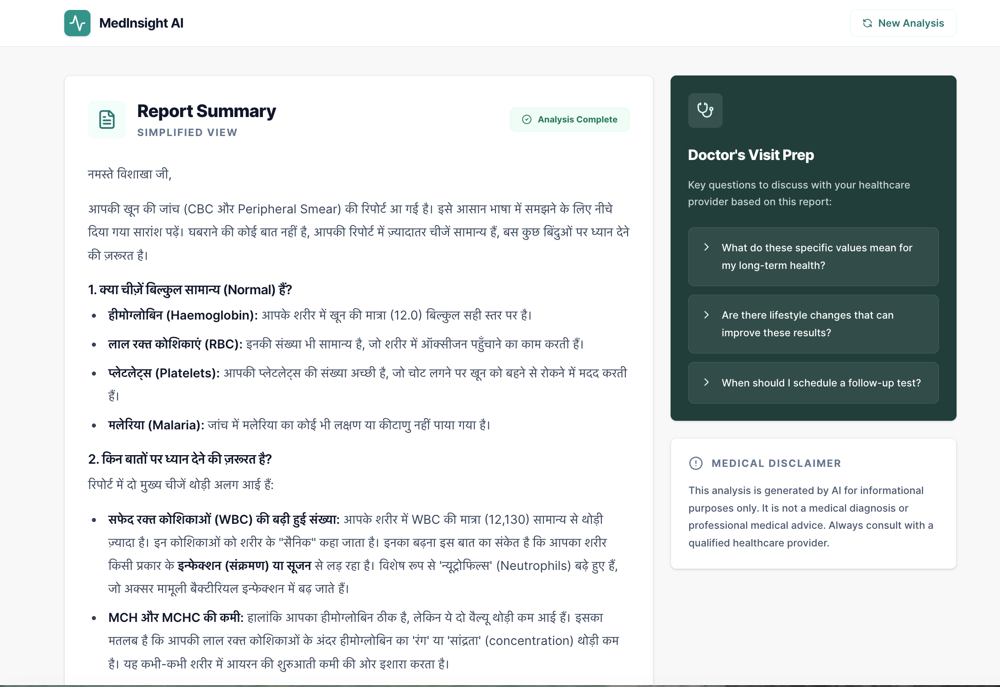
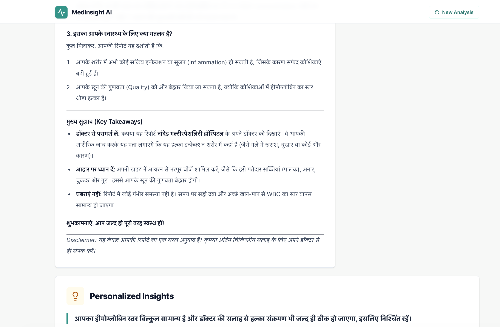
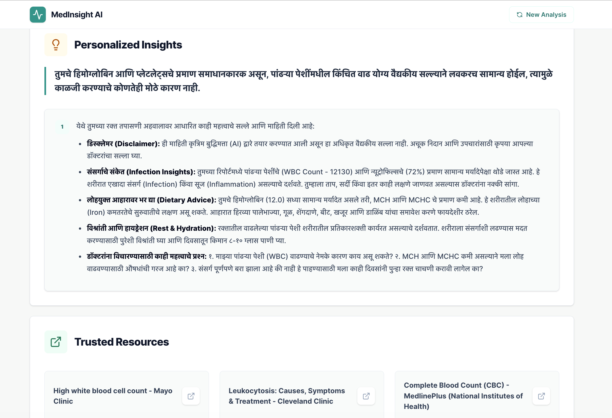
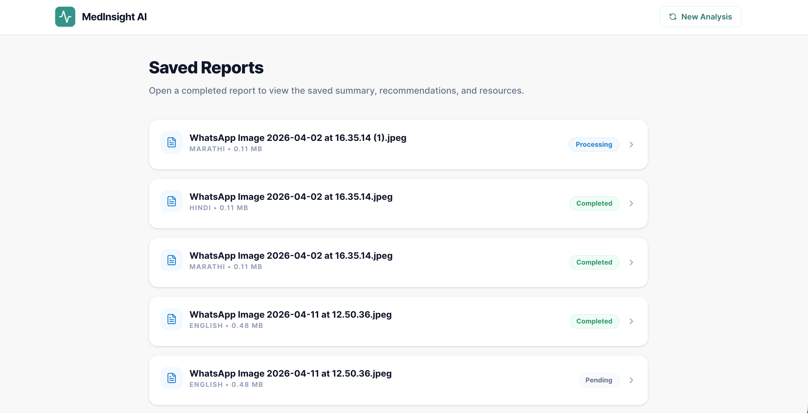

# Health Report Decoder - MedInsight AI

[](https://react.dev/)
[](https://www.typescriptlang.org/)
[](https://vite.dev/)
[](https://www.langchain.com/langgraph)
[](https://ai.google.dev/)

**Health Report Decoder** is an open-source AI medical report analyzer that simplifies lab reports, imaging reports, and clinical health documents into patient-friendly summaries. MedInsight AI uses React, TypeScript, LangGraph, LangChain, and Gemini AI to extract medical findings, explain complex terminology, generate health recommendations, and prepare useful doctor visit questions.

This repository is useful for developers building AI healthcare apps, medical report summarizers, lab report analyzers, patient education tools, multilingual healthcare assistants, or Gemini AI + LangGraph workflows.

## Key Features

- **AI health report decoder** for PDF, JPG, and PNG medical reports.
- **Medical report analyzer** that extracts findings from lab reports and imaging reports.
- **Patient-friendly summaries** that translate medical jargon into simple language.
- **Multilingual output** in English, Hindi, and Marathi.
- **Personalized recommendations** and follow-up questions for a healthcare provider.
- **Trusted resources** from reputable medical information sources.
- **Saved report history** with a local backend and SQLite database.
- **Modern React UI** built with Vite, TypeScript, Tailwind CSS, Motion, and Lucide icons.

## Tech Stack

| Layer | Tools |
| --- | --- |
| Frontend | React 19, TypeScript, Vite, Tailwind CSS |
| AI workflow | LangChain, LangGraph |
| LLM provider | Gemini AI via `@google/genai` and `@langchain/google-genai` |
| Backend | Express, Multer, Better SQLite3 |
| UI support | React Dropzone, React Markdown, Lucide React, Motion |

## Screenshots

<table>
  <tr>
    <td width="50%">
      <strong>AI health report upload screen</strong><br />
      
    </td>
    <td width="50%">
      <strong>Medical report processing screen</strong><br />
      
    </td>
  </tr>
  <tr>
    <td width="50%">
      <strong>Patient-friendly report summary</strong><br />
      
    </td>
    <td width="50%">
      <strong>Personalized health insights</strong><br />
      
    </td>
  </tr>
  <tr>
    <td width="50%">
      <strong>Saved report history</strong><br />
      
    </td>
    <td width="50%"></td>
  </tr>
</table>

## Use Cases

- Decode lab test reports into simple explanations.
- Summarize imaging reports for patient education.
- Build an AI healthcare assistant with Gemini AI.
- Create a multilingual medical report summarizer.
- Learn how to orchestrate medical document analysis with LangGraph.
- Prototype a React medical report analyzer with a local Express API.

## Getting Started

### Prerequisites

- Node.js 20 or newer
- npm
- A Gemini API key

### Installation

```bash
git clone https://github.com/AkshayG999/health-report-decoder.git
cd health-report-decoder
npm install
cp .env.example .env
```

Add your Gemini API key to `.env`.

```bash
GEMINI_API_KEY=your_api_key_here
```

Run the frontend and backend together:

```bash
npm run dev:all
```

Run them separately:

```bash
npm run dev
npm run server
```

## Scripts

| Command | Purpose |
| --- | --- |
| `npm run dev` | Start the Vite React frontend on port 3000 |
| `npm run server` | Start the Express backend watcher |
| `npm run dev:all` | Start frontend and backend together |
| `npm run build` | Build the production frontend |
| `npm run preview` | Preview the production build |
| `npm run lint` | Run TypeScript checks |

## Repository SEO Keywords

`health report decoder`, `medical report analyzer`, `AI medical report analyzer`, `lab report analyzer`, `medical report summarizer`, `AI healthcare app`, `Gemini AI healthcare`, `LangGraph healthcare`, `React medical app`, `multilingual health report summary`, `patient-friendly medical report`.

## Suggested GitHub Topics

Add these topics in the GitHub repository settings to improve GitHub search discovery:

`health-report-decoder`, `medical-report-analyzer`, `ai-healthcare`, `lab-report-analyzer`, `gemini-ai`, `langgraph`, `langchain`, `react`, `typescript`, `vite`, `healthcare-app`, `medical-ai`, `patient-education`, `multilingual-ai`.

## Important Medical Disclaimer

MedInsight AI is for informational and educational purposes only. It is not a medical diagnosis, treatment plan, or substitute for professional medical advice. Always consult a qualified healthcare provider about medical reports, symptoms, diagnoses, or treatment decisions.
